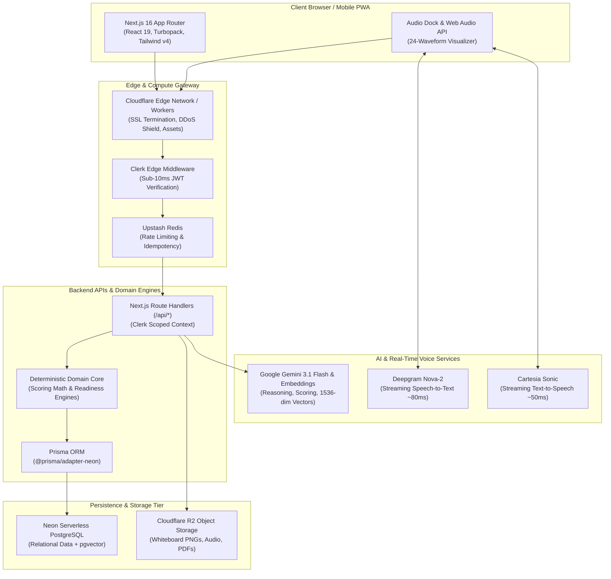

# Infrastructure Architecture & Setup Guide

This document specifies the complete production and development infrastructure topology, verified services, environment configuration, and operational runbooks for **PrepInMinutes**.

---

## 1. System Topology Overview

PrepInMinutes employs a modern, decoupled serverless architecture designed for sub-second latency, zero idle-server maintenance, and strict operational boundaries:



---

## 2. Verified Service Directory

Every service in the table below has been credentialed, integrated into `.env`, and **verified live via automated end-to-end tests**.

| Service Layer                 | Provider            | Model / Endpoint                                  | Role in Platform                                                                                        | Verification Status                                        |
| :---------------------------- | :------------------ | :------------------------------------------------ | :------------------------------------------------------------------------------------------------------ | :--------------------------------------------------------- |
| **Relational & Vector DB**    | **Neon PostgreSQL** | `ep-mute-water-b4tb9s29` (AWS us-east-2)          | Candidate profiles, prep plans, sessions, evaluations, and `pgvector` embeddings.                       | ✅ **Active** (Pooled + Direct configured)                 |
| **In-Memory Cache & Limiter** | **Upstash Redis**   | `driving-goldfish-314581.upstash.io`              | Sliding-window rate limiter (60/10 req/min), submission idempotency cache (24h TTL), distributed locks. | ✅ **Verified Live** (`PONG` received)                     |
| **Object / Blob Storage**     | **Cloudflare R2**   | Bucket: `prepinminutes-assets`                    | S3-compatible storage for Whiteboard diagram PNGs, audio clips, and PDF reports.                        | ✅ **Verified Live** (PUT, GET, DELETE verified)           |
| **Identity & Authentication** | **Clerk**           | Global Edge Authentication                        | Candidate login, edge session guard, avatar management, tenant isolation.                               | ✅ **Active**                                              |
| **Speech-to-Text (STT)**      | **Deepgram**        | Model: `nova-2`                                   | Live streaming candidate microphone transcription with interim transcripts (<80ms latency).             | ✅ **Verified Live** (Project `93a7057e...` active)        |
| **Text-to-Speech (TTS)**      | **Cartesia**        | Model: `sonic-english`                            | Ultra-low-latency AI interviewer voice synthesis with barge-in interruption (<50ms TTFB).               | ✅ **Verified Live** (Voice catalog authenticated)         |
| **AI Reasoning & Embeddings** | **Google Gemini**   | `gemini-3.1-flash-lite`<br>`gemini-embedding-001` | Candidate scoring rubrics, qualitative assessment, structured JSON, 1,536-dim vector embeddings.        | ✅ **Verified Live** (Generation, JSON, Embeddings 200 OK) |

---

## 3. Service Deep-Dives & Technical Configurations

### 3.1. Relational & Vector Database — Neon PostgreSQL

PrepInMinutes uses **Neon Serverless PostgreSQL** with the `pgvector` extension.

#### Connection Architecture:

Neon requires a **two-tier connection configuration**:

1. **Pooled Connection (`DATABASE_URL`)**: Uses Neon's built-in PgBouncer pooler (`-pooler.c-6.us-east-2.aws.neon.tech`). Used by the Prisma Client inside Next.js serverless route handlers to handle high concurrency without connection exhaustion.
2. **Direct Connection (`DIRECT_URL`)**: Connects directly to the compute instance (`ep-mute-water-b4tb9s29.c-6.us-east-2.aws.neon.tech` without `-pooler`). Required by Prisma CLI for advisory locks, schema migrations (`prisma migrate dev`), and DDL schema pushes.

#### Prisma Schema Specification (`prisma/schema.prisma`):

```prisma
datasource db {
  provider   = "postgresql"
  url        = env("DATABASE_URL")
  directUrl  = env("DIRECT_URL")
  extensions = [pgvector(map: "vector")]
}

generator client {
  provider        = "prisma-client-js"
  previewFeatures = ["postgresqlExtensions", "driverAdapters"]
}
```

---

### 3.2. Cache & Edge Rate Limiter — Upstash Redis

PrepInMinutes utilizes **Upstash Redis** over HTTP REST to ensure serverless and edge compatibility without connection overhead.

#### Responsibilities:

- **Sliding Window Rate Limiting** (`@upstash/ratelimit`):
  - General Navigation / APIs: 60 requests/minute per candidate IP.
  - AI Evaluation Triggers: 10 requests/minute per candidate.
- **Request Idempotency**:
  - Intercepts `Idempotency-Key: {sessionId}:{attempt}` headers on `/api/practice/session/submit` and `/api/mock-interview/session/end`.
  - Caches evaluation responses for 24 hours to prevent duplicate LLM cost on network retries.
- **Active Session State**: Real-time whiteboard presence and interview turn tracking.

---

### 3.3. Object Storage — Cloudflare R2 (S3 Compatible)

Cloudflare R2 provides egress-free object storage for binary media assets.

#### Configuration:

- **Bucket**: `prepinminutes-assets`
- **S3 API Endpoint**: `https://b31babb09407fa3e710576af042ea451.r2.cloudflarestorage.com`
- **Client Library**: `@aws-sdk/client-s3` (compatible with standard S3 SDKs).

#### Stored Assets:

1. `/whiteboards/{candidateId}/{sessionId}.png` — High-resolution exports from the SVG/Canvas whiteboard tool.
2. `/recordings/{candidateId}/{sessionId}.opus` — Archived mock interview voice tracks.
3. `/reports/{candidateId}/{reportId}.pdf` — Deterministic evaluation report PDF downloads.

---

### 3.4. AI Reasoning & Vector Embeddings — Google Gemini

Google Gemini replaces legacy OpenAI models across both generative reasoning and mathematical embedding pipelines.

#### Models in Use:

- **Evaluation & Reasoning**: `gemini-3.1-flash-lite` (or `gemini-3.5-flash` / `gemini-2.5-flash`).
  - Utilizes **Structured JSON Schema enforcement** (`responseSchema`) guaranteeing that LLM scoring strictly conforms to TypeScript/Zod rubric contracts.
  - Native 1M+ token context window allows ingesting entire multi-page resumes and lengthy interview transcripts simultaneously.
- **Vector Embeddings**: `gemini-embedding-001`.
  - Configured with `outputDimensionality: 1536` via Matryoshka Representation Learning (MRL).
  - Emits exact **1,536-dimensional vectors**, perfectly aligning with the Neon `DocumentEmbedding` (`vector(1536)`) schema for resume & job description chunk similarity searches.

---

### 3.5. Real-Time Voice Streaming — Deepgram (STT) + Cartesia (TTS)

Powering the interactive AI mock interview experience with a glass-to-glass latency target of **$\le 350\text{ms}$**:

- **Speech-to-Text**: **Deepgram Nova-2**
  - Project ID: `93a7057e-3816-4945-9fda-8f3b1952e5ef`
  - Streaming binary Opus audio chunks over WebSocket; produces interim transcripts in $\approx 80\text{ms}$.
- **Text-to-Speech**: **Cartesia Sonic**
  - Streaming audio chunks in $\approx 50\text{ms}$ (Time-to-First-Audio-Byte).
  - Client-side Voice Activity Detection (Silero VAD) sends abort signals on user barge-in, cutting off audio streams in $<100\text{ms}$.

---

## 4. Environment Variables Manifest

The following variables are configured in `.env` (git-ignored) and templated in `.env.example`:

```bash
# ── 1. Authentication (Clerk) ──
NEXT_PUBLIC_CLERK_PUBLISHABLE_KEY=pk_test_xxxxxxxxxxxxxxxxxxxxxxxxxxxxxxxxxxxx
CLERK_SECRET_KEY=sk_test_xxxxxxxxxxxxxxxxxxxxxxxxxxxxxxxxxxxxxxxxxxxxxxxx
# CLERK_WEBHOOK_SECRET=whsec_... (For user creation webhooks)

# ── 2. Database & Persistence (Neon PostgreSQL) ──
DATABASE_URL="postgresql://[user]:[password]@[endpoint]-pooler.[region].aws.neon.tech/[database]?sslmode=require&channel_binding=require"
DIRECT_URL="postgresql://[user]:[password]@[endpoint].[region].aws.neon.tech/[database]?sslmode=require&channel_binding=require"

# ── 3. In-Memory Cache & Limiter (Upstash Redis) ──
UPSTASH_REDIS_REST_URL="https://[database].upstash.io"
UPSTASH_REDIS_REST_TOKEN="[upstash_token]"

# ── 4. Cloud Object Storage (Cloudflare R2) ──
R2_ACCOUNT_ID="[cloudflare_account_id]"
R2_ENDPOINT="https://[account_id].r2.cloudflarestorage.com"
R2_ACCESS_KEY_ID="[r2_access_key_id]"
R2_SECRET_ACCESS_KEY="[r2_secret_access_key]"
R2_BUCKET_NAME="prepinminutes-assets"

# ── 5. AI Reasoning & Embeddings (Google Gemini) ──
GEMINI_API_KEY="[gemini_api_key]"
GOOGLE_AI_PROJECT_ID="projects/[project_number]"
GOOGLE_AI_PROJECT_NUMBER="[project_number]"

# ── 6. Real-Time Voice Streaming (Deepgram & Cartesia) ──
DEEPGRAM_PROJECT_ID="[deepgram_project_id]"
DEEPGRAM_API_KEY="[deepgram_api_key]"
CARTESIA_API_KEY="sk_car_xxxxxxxxxxxxxxxxxxxx"
```

---

## 5. Cloudflare Full-Stack Deployment Strategy

PrepInMinutes deploys to **Cloudflare**:

### Phase 1: Prototype (Completed)

- Built with `next build` + `output: 'export'`.
- Deployed as static HTML/JS/CSS assets via Cloudflare Pages and `worker/index.ts` with coming-soon gating.

### Phase 2: Dynamic Full-Stack Next.js (In Progress)

- **Deployment Adapter**: Cloudflare recommends **`@opennextjs/cloudflare`** to compile Next.js 16 App Router (RSC, Route Handlers, Server Actions, Middleware) into a native Cloudflare Worker.
- **Wrangler Configuration** (`wrangler.jsonc`):
  ```jsonc
  {
    "name": "prepinminutes",
    "compatibility_date": "2026-08-20",
    "compatibility_flags": ["nodejs_compat"],
    "observability": {
      "enabled": true,
    },
  }
  ```
- **Database Connectivity in Workers**:
  - Prisma Client connects to Neon inside Cloudflare Workers using `@neondatabase/serverless` via `@prisma/adapter-neon`, enabling queries over WebSockets/Fetch without TCP socket limitations.

---

## 6. Service Health Check Runbook

To re-verify any infrastructure component, run the following automated node diagnostics:

### 1. Test Upstash Redis:

```bash
node -e '
fetch(process.env.UPSTASH_REDIS_REST_URL + "/ping", {
  headers: { Authorization: "Bearer " + process.env.UPSTASH_REDIS_REST_TOKEN }
}).then(r => r.json()).then(console.log);
'
```

### 2. Test Deepgram Authentication:

```bash
curl -s -H "Authorization: Token $DEEPGRAM_API_KEY" https://api.deepgram.com/v1/projects
```

### 3. Test Cartesia Authentication:

```bash
curl -s -H "X-API-Key: $CARTESIA_API_KEY" -H "Cartesia-Version: 2024-06-10" https://api.cartesia.ai/voices | head -c 120
```

### 4. Test Google Gemini Generation:

```bash
curl -s -X POST "https://generativelanguage.googleapis.com/v1beta/models/gemini-3.1-flash-lite:generateContent?key=$GEMINI_API_KEY" \
  -H "Content-Type: application/json" \
  -d '{"contents":[{"parts":[{"text":"ping"}]}]}'
```
