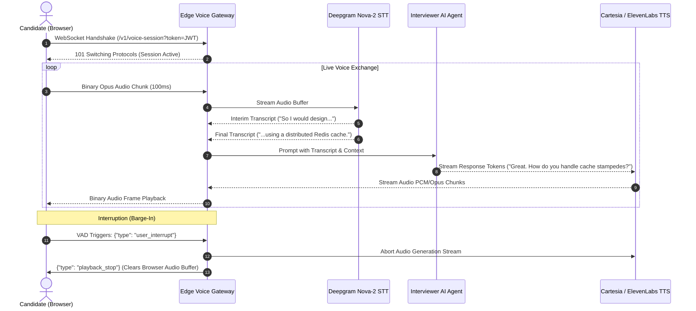

# Layer 3: Real-Time Voice & Media Streaming Layer Architecture

This document specifies the technical architecture for ultra-low-latency bidirectional voice communication, audio waveform analysis, speech-to-text (STT), text-to-speech (TTS), and interruption handling in **PrepInMinutes**.

---

## 1. Architectural Scope & Performance Targets

Mock interview simulations require realistic conversational cadence. A human conversation typically tolerates $< 350\text{ms}$ delay.

### Latency Budget (Target: $\le 350\text{ms}$ Glass-to-Glass)

$$
\begin{aligned}
\text{Client Audio Capture (100ms chunks)} & \approx 100\text{ms} \\
\text{Network Ingress (Edge to Server)} & \approx 30\text{ms} \\
\text{Streaming STT (Deepgram Nova-2)} & \approx 80\text{ms} \\
\text{LLM First Token Generation} & \approx 70\text{ms} \\
\text{Streaming TTS First Audio Chunk (Cartesia / ElevenLabs)} & \approx 50\text{ms} \\
\text{Network Egress & Client Playback Buffer} & \approx 20\text{ms} \\
\hline
\mathbf{\text{Total End-to-End Turnaround}} & \approx \mathbf{350\text{ms}}
\end{aligned}
$$

---

## 2. Voice Streaming Topology



---

## 3. WebSocket Gateway Protocol Specification

### Endpoint: `wss://stream.prepinminutes.com/v1/voice-session`

#### Connection Handshake

- **Headers**:
  - `Authorization: Bearer <clerk_session_jwt>`
  - `X-Session-ID: mock_sd_48102`
  - `X-Target-Role: Senior Infrastructure Engineer`

#### Message Schemas

##### 1. Client to Server: Audio Stream

- **Format**: Raw binary Opus packets sampled at 16,000Hz or 24,000Hz in 100ms buffers.

##### 2. Client to Server: Control Packets (JSON)

```json
{
  "type": "control.interrupt",
  "sessionId": "mock_sd_48102",
  "timestamp": 1759012400120
}
```

##### 3. Server to Client: Transcripts & Assistant Audio

```json
{
  "type": "transcript.interim",
  "speaker": "candidate",
  "text": "For the database layer, I propose PostgreSQL..."
}
```

```json
{
  "type": "audio.start",
  "messageId": "msg_90124",
  "text": "How will you partition the PostgreSQL tables across regions?"
}
```

Followed immediately by binary Opus audio chunks streamed over the same socket.

---

## 4. Voice Activity Detection (VAD) & Barge-In (Interruption)

Realistic mock interviews require candidates to interrupt the interviewer or the interviewer to gently interject when answers drift off-topic:

1. **Client-Side VAD (Silero VAD WebAssembly)**:
   - Evaluates input microphone volume and speech probability.
   - When candidate starts speaking while the interviewer is speaking:
     - Client immediately mutes the incoming audio track.
     - Sends `{"type": "control.interrupt"}` packet upstream.
2. **Server-Side Abort Controller**:
   - Gateway signals `AbortController.abort()` to the running TTS stream and LLM token generator.
   - Immediately stops outbound audio bytes, freeing socket bandwidth for candidate's speech.

---

## 5. Waveform Visualizer & Audio Buffer Management

The frontend [`PracticeCodingWorkspace.tsx`](file:///Users/saurav/Desktop/development/prep-in-minutes/src/components/practice/PracticeCodingWorkspace.tsx) and [`MockInterviewSessionWorkspace.tsx`](file:///Users/saurav/Desktop/development/prep-in-minutes/src/components/mock-interview/session/MockInterviewSessionWorkspace.tsx) manage audio state via Web Audio API:

```ts
// Audio Dock Buffer Controller
export class VoiceStreamController {
  private audioCtx: AudioContext;
  private mediaStream: MediaStream | null = null;
  private socket: WebSocket | null = null;

  async start(wsUrl: string) {
    this.audioCtx = new AudioContext({ sampleRate: 16000 });
    this.mediaStream = await navigator.mediaDevices.getUserMedia({
      audio: {
        echoCancellation: true,
        noiseSuppression: true,
        autoGainControl: true,
      },
    });

    const source = this.audioCtx.createMediaStreamSource(this.mediaStream);
    const processor = this.audioCtx.createScriptProcessor(4096, 1, 1);
    source.connect(processor);
    processor.connect(this.audioCtx.destination);

    processor.onaudioprocess = (e) => {
      const inputData = e.inputBuffer.getChannelData(0);
      const opusChunk = this.encodeOpus(inputData);
      if (this.socket?.readyState === WebSocket.OPEN) {
        this.socket.send(opusChunk);
      }
    };
  }
}
```

---

## 6. Resilience & Graceful Fallbacks

1. **Flaky Network Detection**:
   - If WebSocket packet round-trip time (RTT) exceeds $600\text{ms}$ or packet loss exceeds 8%, the client displays a banner: `"Audio connection unstable — switching to text mode"`.
2. **Text Typing Fallback**:
   - Audio dock immediately collapses into an inline text prompt input field (`<input type="text" placeholder="Type your response..." />`).
   - The session proceeds without loss of interview context or timer interruption.
3. **Microphone Permission Denied**:
   - Workspaces default directly to Text Mode without blocking or crashing the application.

---

## 7. Developer Implementation & Verification Checklist

- [ ] WebSocket connections authenticate against Clerk JWT before accepting audio frames.
- [ ] Voice turnaround latency stays $\le 350\text{ms}$ under typical broadband conditions.
- [ ] Barge-In cleanly cancels server audio generation within $150\text{ms}$.
- [ ] Falling back to Text Mode preserves current question, elapsed timer, and interview stage.
