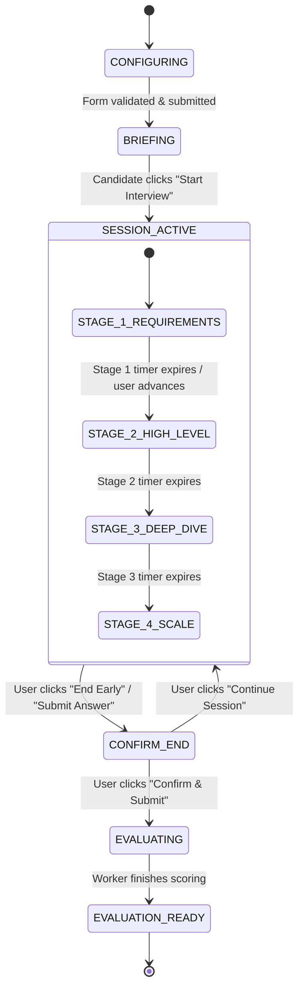

# Layer 5: Deterministic Domain Core Services Layer Architecture

This document specifies the pure mathematical algorithms, scoring models, Bayesian readiness trajectory calculation, spaced repetition decay formulas, and state validation engines in **PrepInMinutes**.

---

## 1. Architectural Scope & Deterministic Guarantees

All quantitative evaluations, progress graphs, readiness numbers, review schedules, and state transitions are owned by **pure, deterministic backend services**:

$$\text{LLM Output (Qualitative Rubric)} \xrightarrow{\text{Structured Extraction}} \boxed{\text{Deterministic Domain Core}} \xrightarrow{\text{Mathematical Audit}} \text{Database \& UI}$$

### Key Invariants

1. **Auditable & Reproducible**: Given the same rubric marks and history, the readiness score calculation will yield the exact same result every time.
2. **Zero Hallucination**: No LLM prompt directly manipulates scores or writes to the database.
3. **Strict Validation**: All state machine transitions are validated against hardcoded state diagrams.

---

## 2. Mathematical Scoring & Rubric Engine

### System Design Scoring Formula

A session's final score $S \in [0, 100]$ is computed as a weighted sum of the 6 dimensions:

$$S = 10 \times \sum_{i=1}^{6} (w_i \cdot s_i)$$

Where $s_i \in [1.0, 10.0]$ and the weights $w_i$ sum to $1.0$:

| Dimension ($i$)                  | Weight ($w_i$) | Hiring Bar Rationale                                                          |
| -------------------------------- | -------------- | ----------------------------------------------------------------------------- |
| **Technical Depth**              | $0.25$         | Deep understanding of protocols, storage engines, and internal mechanics.     |
| **Reasoning & Trade-offs**       | $0.25$         | Clear justification for choosing technology X over technology Y (CAP, costs). |
| **Data Modeling & Architecture** | $0.20$         | Sound database schemas, partition keys, and clean component decoupling.       |
| **Communication**                | $0.15$         | Structured thought process, active listening, and concise explanations.       |
| **Scalability & Edge Cases**     | $0.15$         | Handling peak loads, network partitions, failovers, and hot keys.             |

### Coding Drill Scoring Formula

$$S_{\text{coding}} = 0.40 \cdot C_{\text{tests}} + 0.25 \cdot T_{\text{complexity}} + 0.15 \cdot M_{\text{space}} + 0.20 \cdot Q_{\text{style}}$$

Where $C_{\text{tests}}$ is the percentage of passing test cases ($0 - 100$), $T$ is time complexity compliance, $M$ is space efficiency, and $Q$ is readability/modularity.

---

## 3. Candidate Readiness Trajectory Engine

The **Readiness Score** ($R \in [0, 100]$) represents a candidate's probability of clearing hiring bars for their target role and company tier.

### Moving Average Formula with Difficulty Calibration

$$R_{\text{new}} = \text{round}\Big( R_{\text{old}} \cdot (1 - \alpha) + S_{\text{session}} \cdot \alpha \cdot \beta_{\text{difficulty}} \Big)$$

Where:

- $\alpha = 0.15$: Learning inertia factor (prevents a single anomalous session from wildly skewing readiness).
- $\beta_{\text{difficulty}}$: Difficulty scaling multiplier:
  - Junior: $0.85$
  - Mid-Level: $1.00$
  - Senior: $1.10$
  - Staff / Principal: $1.20$
- Readiness Delta: $\Delta R = R_{\text{new}} - R_{\text{old}}$ (e.g. $+5\%$, $+6\%$, displayed on the evaluation cards).

```ts
// src/lib/domain/readiness-engine.ts
export function calculateReadinessDelta(
  currentReadiness: number,
  sessionScore: number,
  difficulty: "junior" | "mid" | "senior" | "staff",
): { newReadiness: number; delta: number } {
  const multipliers = { junior: 0.85, mid: 1.0, senior: 1.1, staff: 1.2 };
  const alpha = 0.15;
  const effectiveScore = sessionScore * multipliers[difficulty];

  const rawNew = currentReadiness * (1 - alpha) + effectiveScore * alpha;
  const newReadiness = Math.min(100, Math.max(0, Math.round(rawNew)));
  const delta = newReadiness - currentReadiness;

  return { newReadiness, delta };
}
```

---

## 4. Spaced Repetition Decay Engine (SuperMemo SM-2)

The Revision module ([`src/app/revision/page.tsx`](file:///Users/saurav/Desktop/development/prep-in-minutes/src/app/revision/page.tsx)) schedules retention drills based on memory decay:

```
Session Score < 60%  ───> [ Enqueue in Revision Queue ] (Priority = Urgent)
                                   │
                                   ▼
                      Interval 1: +1 Day Review
                                   │
                                   ▼ (Candidate Passes Recall Drill)
                      Interval 2: +3 Days Review
                                   │
                                   ▼
                      Interval n: + (I_{n-1} * EF) Days
```

### Formulas

1. **Easiness Factor ($EF$)**:
   $$EF' = EF + (0.1 - (5 - q) \cdot (0.08 + (5 - q) \cdot 0.02))$$
   Where $q \in [0, 5]$ is candidate recall quality ($EF \ge 1.3$).
2. **Review Interval ($I$)**:
   $$I(n) = \begin{cases} 1 \text{ day} & n = 1 \\ 3 \text{ days} & n = 2 \\ I(n-1) \cdot EF' & n > 2 \end{cases}$$

---

## 5. Deterministic State Machine Enforcement

All workspaces enforce deterministic stage transitions:



### Transition Guard Rules

- Direct jumps from `CONFIGURING` to `EVALUATING` are rejected with HTTP 400.
- If a candidate reloads the page, session status is retrieved from Redis/DB and restored to the exact current stage.

---

## 6. Developer Implementation & Verification Checklist

- [ ] Unit tests verify scoring algorithms against 100% boundary conditions ($0.0$, $10.0$, negative numbers, NaN).
- [ ] Readiness calculations never exceed 100% or drop below 0%.
- [ ] SM-2 decay calculations enforce minimum $EF = 1.3$.
- [ ] State transitions reject illegal sequence mutations with deterministic error codes.
