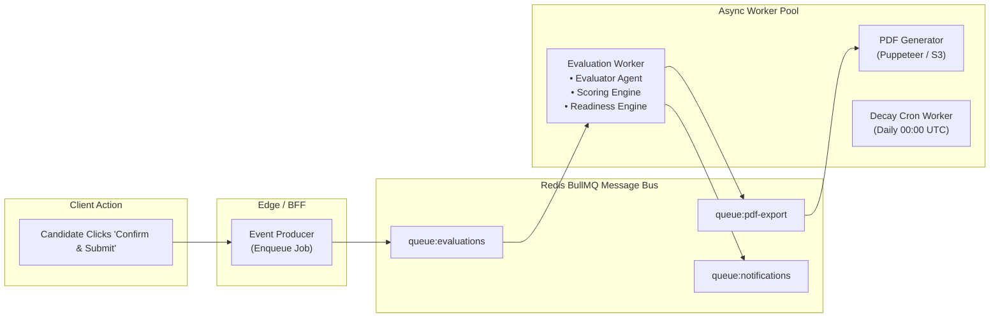

# Layer 7: Event-Driven Analytics, Jobs & Telemetry Layer Architecture

This document specifies the asynchronous job worker topology, event bus topics, scheduled cron tasks, and observability telemetry pipelines in **PrepInMinutes**.

---

## 1. Architectural Scope & Asynchronous Objectives

Heavyweight operations—such as multi-stage transcript evaluation, PDF generation, memory decay calculations, and telemetry dispatching—must never block candidate HTTP requests or live voice sessions:

1. **Decoupled Asynchrony**: Offload evaluation generation to background worker queues (`BullMQ` / Redis).
2. **Event Sourcing for Auditability**: Every candidate interaction emits an immutable domain event.
3. **Automated Scheduled Maintenance**: Nightly cron jobs compute memory decay intervals for spaced repetition queues.
4. **End-to-End Observability**: Distributed tracing across frontend clicks, edge proxies, WebSocket frames, and LLM completions.

---

## 2. Event-Driven Architecture & Queue Topology



---

## 3. Core Event Topics & Handlers

### 1. `practice.session.submitted` / `mock.session.completed`

- **Payload**:
  ```json
  {
    "eventId": "evt_891024",
    "sessionId": "mock_sd_48102",
    "candidateId": "cand_1234",
    "sessionType": "mock-interview",
    "transcript": [...],
    "whiteboardUrl": "s3://.../whiteboard.png",
    "timestamp": 1759012400
  }
  ```
- **Execution Pipeline**:
  1. Invokes the **Rubric Evaluator Agent** (`EvaluationRubricSchema`).
  2. Feeds raw marks into the **Mathematical Scoring Engine**.
  3. Calculates readiness growth via the **Readiness Trajectory Engine** ($\Delta R$).
  4. Enqueues weak areas ($< 60\%$) into the **Spaced Repetition Queue**.
  5. Enqueues PDF report generation job.

### 2. `evaluation.report.generated`

- Emits real-time notification to the candidate's browser via WebSocket or server-sent events:
  ```json
  {
    "type": "evaluation.ready",
    "reportId": "rep_90124",
    "verdict": "Strong Hire"
  }
  ```

---

## 4. Scheduled Jobs & Cron Architecture

Managed via `BullMQ` repeatable jobs or Vercel Cron:

```ts
// src/lib/workers/cron-scheduler.ts
import { Queue } from "bullmq";
import { redisConnection } from "../redis";

const cronQueue = new Queue("cron-maintenance", {
  connection: redisConnection,
});

// Daily Spaced Repetition Decay Job (Every midnight UTC)
export async function scheduleDailyDecayCron() {
  await cronQueue.add(
    "calculate-memory-decay",
    {},
    {
      repeat: {
        pattern: "0 0 * * *", // Cron syntax
      },
      jobId: "daily-memory-decay-job",
    },
  );
}
```

### Nightly Tasks

1. Scans `RevisionItem` where `nextReviewDate <= NOW()`.
2. Computes retention decay score and moves topics to the urgent active queue.
3. Calculates daily activity streaks and updates candidate profiles.

---

## 5. Telemetry, Tracing & Observability

### OpenTelemetry (OTel) Distributed Tracing

Tracks end-to-end latency across all services:

- **Trace Context**: Transmitted via W3C Traceparent headers (`traceparent: 00-4bf92f3577b34da6a3ce929d0e0e4736-00f067aa0ba902b7-01`).
- **Span Hierarchy**:
  ```
  HTTP POST /api/practice/session/submit [Total: 840ms]
  ├── Edge Rate Limit Check [4ms]
  ├── Redis Idempotency Lock [2ms]
  ├── Event Enqueue [12ms]
  └── Async Evaluation Worker [14.2s]
      ├── LLM Rubric Generation [11.8s]
      ├── Deterministic Scoring Math [1ms]
      ├── Database Report Write [45ms]
      └── PDF Export Job [2.3s]
  ```

### Key Performance Indicators (Prometheus / Datadog)

- `voice_turnaround_latency_ms`: p50 $\le 280\text{ms}$, p95 $\le 450\text{ms}$.
- `evaluation_generation_duration_sec`: p50 $\le 12\text{s}$, p95 $\le 20\text{s}$.
- `llm_token_cost_cents_per_session`: Tracked per candidate tier.
- `voice_barge_in_cancellation_latency_ms`: $\le 150\text{ms}$.

---

## 6. Developer Implementation & Verification Checklist

- [ ] All queue workers execute in isolated Node.js worker processes (decoupled from the Next.js web process).
- [ ] Failed jobs automatically retry with exponential backoff (attempts: 3, delay: 2000ms).
- [ ] Dead Letter Queue (DLQ) captures persistently failing evaluation jobs with alerts dispatched to Slack/Sentry.
- [ ] All traces mask sensitive candidate PII (emails, raw resume text) before shipping to telemetry collectors.
