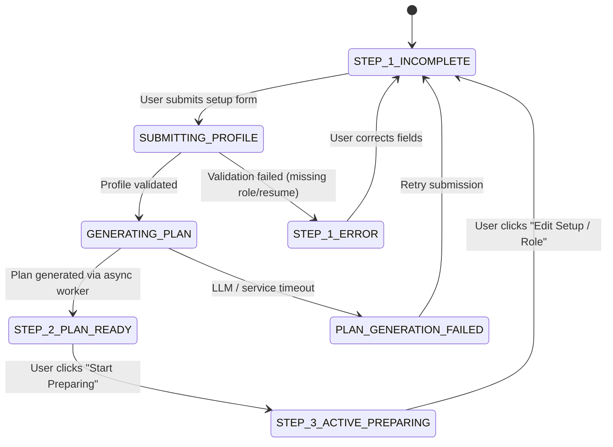

# Dashboard — State Machine & State Handling

This document specifies the client state machine, loading states, empty states, and error handling for the Dashboard module.

---

## 1. Onboarding Lifecycle State Machine

---

## 2. Storage & Persistence Invariant

In `src/components/dashboard/DashboardView.tsx`, the onboarding state uses `useSyncExternalStore` reading from `localStorage.getItem("prep_onboarding_completed")`:

- When `localStorage.getItem("prep_onboarding_completed") === "true"`, the user directly sees `StartPreparingWorkspace`.
- URL override query params:
  - `?setup=true` or `?edit=true`: forces `manualSetupMode = true`, rendering Step 1 form.
  - `?step=3`: sets `prep_onboarding_completed = "true"` in storage and renders Step 3 workspace.

---

## 3. Loading, Empty & Error States

| State                | Visual Treatment                                                                                                                                   | Trigger                             |
| -------------------- | -------------------------------------------------------------------------------------------------------------------------------------------------- | ----------------------------------- |
| **Initial Loading**  | Suspense fallback renders `
`                                                     | Page initial mount                  |
| **Resume Uploading** | Progress spinner inside dropzone with filename and cancel button                                                                                   | File selected                       |
| **Plan Generating**  | Stepper shows pulsing orange dot on Step 2 with message _"Analyzing resume and tailoring questions..."_                                            | Form submitted                      |
| **Empty Questions**  | If resume extraction returns no questions, display _"Practice general system design while your resume finishes parsing"_ with fallback drill cards | Extraction worker pending           |
| **Validation Error** | Red border on required inputs with error label below the input                                                                                     | User submits without selecting role |
