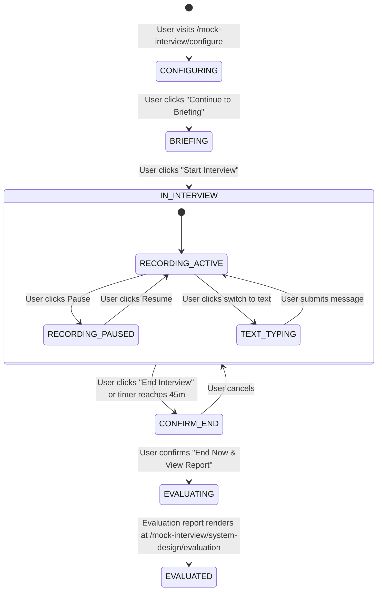

# Mock Interview — State Machine & Session Lifecycle

This document defines the state transitions across the 4 mock interview phases.

---

## 1. Mock Interview Lifecycle State Machine

---

## 2. Timer & Audio Waveform Rules

- **Total Duration**: Initialized to 45:00 (`45 * 60` seconds).
- **Elapsed Counter**: Increments every 1000ms via `setInterval` when `!isPaused`.
- **Waveform Animation**: 24 animated frequency bars (`WAVEFORM_HEIGHTS`) transitioning dynamically; bars flatten to `4px` with `0.4` opacity when paused.
- **Audio Dock Container**: Bounded with `overflow-hidden` and `shrink-0` on bars to prevent mobile horizontal blowout.
