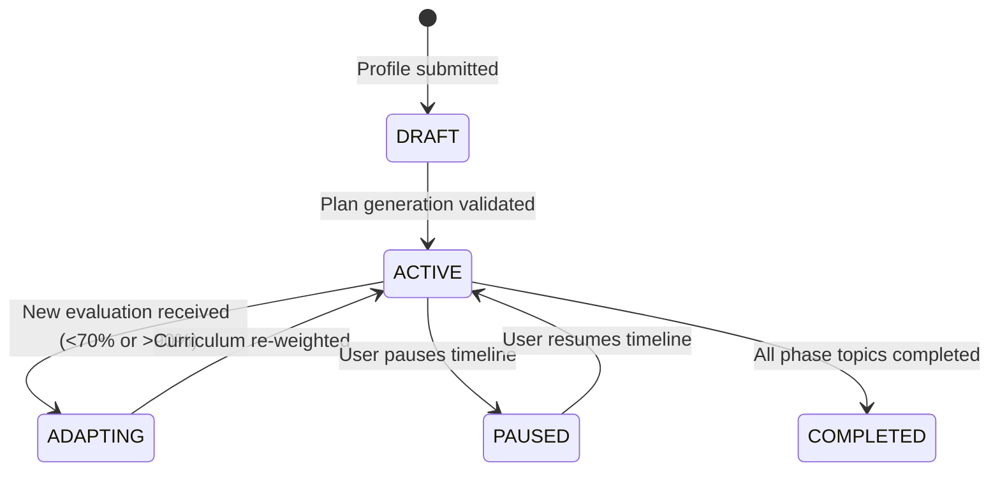

# My Preparation Plan — State Machine & Recalculation Triggers

This document details the lifecycle states and dynamic re-weighting triggers for preparation plans.

---

## 1. Plan Lifecycle State Machine

---

## 2. Recalculation Triggers

The preparation plan is automatically adapted when:

1. **Mock Interview Evaluation Completed**: Weak areas identified in a mock interview (e.g. Caching scored 6/10) trigger an automated insertion of 2 targeted practice drills into the active phase.
2. **Practice Evaluation Underperformance**: Scoring $< 60\%$ on a practice drill increases that topic's priority and moves related topics up in the queue.
3. **Timeline Extension**: Candidate changes timeline in settings from 4 weeks to 8 weeks; phase durations and hours/week automatically re-scale.
