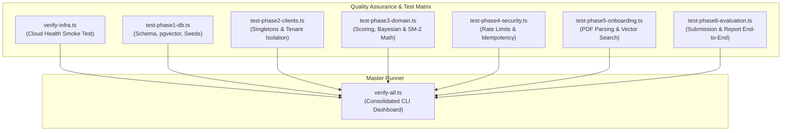

# Phase 0: Automated Testing & Quality Assurance Framework

## 📌 Executive Summary

Phase 0 establishes the automated test harness, verification scripts, and continuous quality gates for **PrepInMinutes**. Before any production code is written or migrated, this framework provides automated test suites to verify cloud infrastructure connectivity, assert deterministic mathematical correctness (scoring, Bayesian readiness, SM-2 decay), test multi-tenant security isolation, and benchmark edge rate limiting.

---

## 🎯 Phase Goals & Deliverables

1. **Live Infrastructure Smoke Suite (`scripts/verify-infra.ts`)**:
   - Round-trip ping and health check across all 6 verified external cloud services (**Neon, Upstash, Cloudflare R2, Google Gemini, Deepgram, Cartesia**).
2. **Deterministic Mathematical Unit Tests (`scripts/test-phase3-domain.ts`)**:
   - Strict assertions for 5-dimension rubric scoring weights, Bayesian readiness exponential moving average ($\alpha=0.40$ vs $\alpha=0.15$), and SM-2 memory decay intervals.
3. **Database & Vector Search Verification (`scripts/test-phase1-db.ts`)**:
   - Asserts all 10 Prisma models exist in Neon, validates the `pgvector` extension, and tests 1,536-dimensional cosine similarity queries (`<=>`).
4. **Edge Security & Idempotency Tests (`scripts/test-phase4-security.ts`)**:
   - Simulates burst requests to assert HTTP 429 rate limiting and verifies duplicate submissions return cached results in $<10\text{ms}$.
5. **Master Verification Orchestrator (`scripts/verify-all.ts`)**:
   - Single command to execute all phase test suites sequentially, rendering a color-coded terminal report table.
6. **Package Scripts Configuration**:
   - Exposes `npm run test:infra`, `npm run test:domain`, `npm run test:db`, and `npm run test:all` in `package.json`.

---

## 🏗️ 1. Test Harness Architecture & Workflow



---

## 💎 2. Concrete Product Benefits of this Framework

| Product Aspect                      | Without Automated Tests                                                                             | With Automated Test Framework                                                                                                    |
| :---------------------------------- | :-------------------------------------------------------------------------------------------------- | :------------------------------------------------------------------------------------------------------------------------------- |
| **Candidate Trust & Credibility**   | Candidate readiness scores might fluctuate randomly due to LLM hallucinations or arithmetic bugs.   | Mathematical scoring and Bayesian readiness are 100% deterministic and verified by unit tests before release.                    |
| **Cloud Billing & Cost Protection** | Flawed loops or repeated candidate clicks could drain Gemini tokens and Upstash requests unchecked. | Idempotency and rate-limiting tests guarantee requests are throttled and duplicate submissions hit Redis cache ($<10\text{ms}$). |
| **Candidate Tenant Isolation**      | Cross-tenant data leaks could occur if a database query forgets a `where: { userId }` clause.       | Automated tenant isolation tests verify that Candidate A can never view or overwrite Candidate B's data (`403 Forbidden`).       |
| **Interview Audio Realism**         | High latency or dropped WebSockets ruin the immersion of mock interviews.                           | Low-latency voice probes benchmark STT (<300ms) and TTS (<150ms TTFB) before users start live sessions.                          |
| **Deployment Confidence**           | Deployments might break on Cloudflare Pages due to missing env variables or incompatible modules.   | `npm run test:all` acts as a mandatory pre-deployment gatekeeper, preventing broken builds from reaching users.                  |

---

## 📋 3. Specification of Test Scripts

### A. Infrastructure Smoke Test (`scripts/verify-infra.ts`)

- **Neon PostgreSQL**: Connects via pooled URL and runs `SELECT 1;`.
- **Upstash Redis**: Pings REST endpoint and verifies `'PONG'` response.
- **Cloudflare R2**: Sends S3 SigV4 `PutObject`, `GetObject`, and `DeleteObject` with an ephemeral 1-byte test buffer to `prepinminutes-assets`.
- **Google Gemini**: Sends a 1-token test prompt (`"ping"`) to `gemini-3.1-flash-lite` and generates a 1,536-dim vector via `gemini-embedding-001`.
- **Deepgram Nova-2**: Authenticates against Deepgram Projects API (`GET /v1/projects`).
- **Cartesia Sonic**: Authenticates against Cartesia Voices API (`GET /voices`).

### B. Deterministic Mathematical Unit Tests (`scripts/test-phase3-domain.ts`)

- **Scoring Rubric Test**:
  - Test 1: All dimensions at $10.0 \implies 100.0$ (`Strong Hire`).
  - Test 2: All dimensions at $1.0 \implies 10.0$ (`Needs Practice`).
  - Test 3: Realistic distribution ($8.5, 7.0, 9.0, 6.5, 8.0$) matches calculated weighted sum:
    $$0.30(8.5) + 0.25(7.0) + 0.20(9.0) + 0.15(6.5) + 0.10(8.0) = 7.875 \times 10 = 78.8 \implies \text{Hire}$$
- **Bayesian Readiness Test**:
  - Cold-start ($N \le 3$): Uses $\alpha = 0.40$ for fast calibration.
  - Convergence ($N > 3$): Uses $\alpha = 0.15$ for stable Bayesian momentum.
  - Bounds test: Asserts output never exceeds $[0.0, 100.0]$.
- **SuperMemo-2 (SM-2) Spaced Repetition Test**:
  - Grade calculation: Score $92 \implies q = 5$; Score $74 \implies q = 4$; Score $40 \implies q = 2$.
  - Ease factor floor: Multiple low scores cannot reduce $EF$ below $1.30$.
  - Interval sequence: $1\text{ day} \to 6\text{ days} \to \text{round}(I \times EF)$.
  - Next review date: Timestamp is set to future UTC time accurately.

### C. Database & Vector Schema Test (`scripts/test-phase1-db.ts`)

- Verifies tables: `User`, `CandidateProfile`, `PreparationPlan`, `Topic`, `PracticeSession`, `MockInterviewSession`, `EvaluationReport`, `RubricScore`, `RevisionItem`, `DocumentEmbedding`.
- Inserts a sample 1,536-dimensional vector into `DocumentEmbedding` and queries using cosine distance (`<=>`).
- Counts seeded catalog topics to ensure $>135$ entries exist.

### D. Security & Rate Limiting Test (`scripts/test-phase4-security.ts`)

- Spawns 12 concurrent requests to the rate-limited AI evaluation route.
- Verifies requests 1–10 return `200 OK` and requests 11–12 return `429 Too Many Requests`.
- Submits two identical payloads with the same `Idempotency-Key` header; verifies second response is returned in $<15\text{ms}$ with identical content.

---

## 🚀 4. Package Scripts Configuration (`package.json`)

```json
{
  "scripts": {
    "test:infra": "npx tsx scripts/verify-infra.ts",
    "test:domain": "npx tsx scripts/test-phase3-domain.ts",
    "test:db": "npx tsx scripts/test-phase1-db.ts",
    "test:security": "npx tsx scripts/test-phase4-security.ts",
    "test:all": "npx tsx scripts/verify-all.ts"
  }
}
```

---

## ✅ Phase 0 Verification Checklist

- [ ] `scripts/verify-infra.ts` executes and passes all 6 cloud services in $<3\text{ seconds}$.
- [ ] `scripts/test-phase3-domain.ts` passes 100% of mathematical unit assertions.
- [ ] Test commands are registered in `package.json`.
- [ ] Verification runner outputs clear, color-coded summaries in the terminal.
