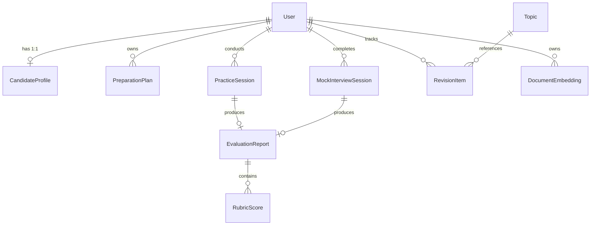

# Phase 1: Persistence Foundation (Prisma ORM, Neon PostgreSQL & pgvector)

## 📌 Executive Summary

Phase 1 establishes the relational and vector persistence layer for PrepInMinutes on **Neon Serverless PostgreSQL**. It deploys the native `pgvector` extension for 1,536-dimensional semantic similarity lookups, establishes 10 core relational models, configures dual connection pooling to support PgBouncer without breaking migrations, and seeds over 135 curriculum topics.

---

## 🎯 Phase Goals & Deliverables

1. Install Prisma ORM dependencies and Neon serverless adapters.
2. Author `prisma/schema.prisma` with `pgvector` and 10 relational models.
3. Configure dual database connection URLs: pooled `DATABASE_URL` for application queries and unpooled `DIRECT_URL` for schema migrations.
4. Execute `npx prisma db push` to synchronize schemas with live Neon PostgreSQL.
5. Create `prisma/seed.ts` to populate the initial catalog with 40+ system design topics, 50+ algorithm patterns, 20+ behavioral questions, and 25+ cloud scenarios.

---

## 📦 1. Dependencies & Package Installation

```bash
# Production dependencies
npm install @prisma/client @prisma/adapter-neon @neondatabase/serverless ws

# Development dependencies
npm install -D prisma @types/ws ts-node
```

---

## 🗄️ 2. Prisma Configuration & Dual Connection Strategy

Neon Serverless PostgreSQL uses PgBouncer in transaction mode for connection pooling. While optimal for serverless HTTP and edge queries, transaction pooling does not support Postgres advisory locks, causing Prisma migrations to fail if pointed at the pooled port.

### Datasource Configuration (`prisma/schema.prisma`)

```prisma
datasource db {
  provider  = "postgresql"
  url       = env("DATABASE_URL")      // ep-nameless-feather-a1h2h9r6-pooler (port 5432)
  directUrl = env("DIRECT_URL")        // ep-nameless-feather-a1h2h9r6 (direct connection)
  extensions = [pgvector(map: "vector")]
}

generator client {
  provider        = "prisma-client-js"
  previewFeatures = ["driverAdapters", "postgresqlExtensions"]
}
```

---

## 📐 3. The 10 Core Relational Models



### Model Specifications

1. **`User`**:
   - `id`: CUID primary key
   - `clerkId`: String (unique, indexed) — Foreign key from Clerk auth token
   - `email`: String (unique)
   - `fullName`: String?
   - `createdAt`: DateTime (default now)
   - `updatedAt`: DateTime (updatedAt)

2. **`CandidateProfile`**:
   - `id`: CUID primary key
   - `userId`: CUID (unique, foreign key to `User.id`)
   - `targetRole`: String (e.g., "Senior Software Engineer")
   - `experienceLevel`: String (e.g., "mid", "senior", "staff")
   - `targetCompanies`: String[] (e.g., `["Google", "Meta", "Amazon"]`)
   - `timelineWeeks`: Int (e.g., 8)
   - `weeklyGoalHours`: Int (default 10)
   - `readinessScore`: Float (0.0 to 100.0, default 0.0)
   - `streakDays`: Int (default 0)
   - `lastActiveDate`: DateTime?

3. **`PreparationPlan`**:
   - `id`: CUID primary key
   - `userId`: CUID (foreign key to `User.id`)
   - `targetSeniority`: String
   - `status`: String (enum: `draft`, `active`, `completed`, `recalibrating`)
   - `weeksTotal`: Int
   - `milestones`: Json (Array of weekly goals, required topics, and status)
   - `createdAt`: DateTime (default now)

4. **`Topic`**:
   - `id`: CUID primary key
   - `domain`: String (enum: `system-design`, `coding`, `behavioral`, `cloud`)
   - `slug`: String (unique, indexed)
   - `title`: String
   - `description`: String?
   - `difficulty`: String (enum: `beginner`, `intermediate`, `advanced`)
   - `estimatedMinutes`: Int
   - `prerequisites`: String[]
   - `rubricCriteria`: Json

5. **`PracticeSession`**:
   - `id`: CUID primary key
   - `userId`: CUID (foreign key to `User.id`)
   - `domain`: String
   - `topicSlug`: String
   - `solutionDraft`: String? (Code or text explanation)
   - `whiteboardUrl`: String? (Cloudflare R2 image link)
   - `durationSeconds`: Int (default 0)
   - `status`: String (enum: `in_progress`, `submitted`, `evaluated`, `abandoned`)
   - `createdAt`: DateTime (default now)

6. **`MockInterviewSession`**:
   - `id`: CUID primary key
   - `userId`: CUID (foreign key to `User.id`)
   - `interviewType`: String (enum: `system-design`, `fullstack-coding`, `behavioral-leadership`)
   - `targetRole`: String
   - `difficulty`: String
   - `transcript`: Json (Array of turns: `{ role, content, timestamp, audioUrl }`)
   - `audioRecordingUrl`: String? (Cloudflare R2 link)
   - `durationMinutes`: Int (default 45)
   - `status`: String (enum: `scheduled`, `in_progress`, `completed`, `canceled`)
   - `createdAt`: DateTime (default now)

7. **`EvaluationReport`**:
   - `id`: CUID primary key
   - `practiceSessionId`: CUID? (unique, foreign key to `PracticeSession.id`)
   - `mockInterviewSessionId`: CUID? (unique, foreign key to `MockInterviewSession.id`)
   - `overallScore`: Float (0.0 to 100.0)
   - `verdict`: String (enum: `Strong Hire`, `Hire`, `Needs Practice`)
   - `readinessDelta`: Float (e.g., +3.2)
   - `evaluatorNotes`: String (Markdown formatted qualitative review)
   - `strengths`: String[]
   - `improvements`: String[]
   - `createdAt`: DateTime (default now)

8. **`RubricScore`**:
   - `id`: CUID primary key
   - `reportId`: CUID (foreign key to `EvaluationReport.id`)
   - `dimension`: String (enum: `technical_depth`, `tradeoffs_reasoning`, `communication_structure`, `scalability_failure_modes`, `code_diagram_quality`)
   - `score`: Float (1.0 to 10.0)
   - `assessment`: String

9. **`RevisionItem`**:
   - `id`: CUID primary key
   - `userId`: CUID (foreign key to `User.id`)
   - `topicId`: CUID (foreign key to `Topic.id`)
   - `intervalDays`: Float (default 1.0)
   - `easeFactor`: Float (default 2.5)
   - `repetitions`: Int (default 0)
   - `lastReviewedDate`: DateTime?
   - `nextReviewDate`: DateTime (default now, indexed)

10. **`DocumentEmbedding`**:
    - `id`: CUID primary key
    - `userId`: CUID (foreign key to `User.id`)
    - `docType`: String (enum: `resume`, `job_description`, `topic_reference`)
    - `chunkIndex`: Int
    - `content`: String
    - `metadata`: Json?
    - `embedding`: Unsupported("vector(1536)")
    - `createdAt`: DateTime (default now)

---

## ⚡ 4. Database Migration Execution

Once `prisma/schema.prisma` is created, execute:

```bash
# Push schema directly to Neon PostgreSQL using DIRECT_URL
npx prisma db push

# Generate strong TypeScript types
npx prisma generate
```

---

## 📚 5. Catalog Seeding (`prisma/seed.ts`)

Populate high-yield interview curricula to ensure immediate zero-friction practice availability:

- **System Design (40+ topics)**: Distributed Cache, URL Shortener, Rate Limiter, Message Queue, Uber Geo-dispatch, WhatsApp Chat, Payment Gateway.
- **Algorithm Patterns (50+ patterns)**: Max Sum Subarray (Kadane's), Two Pointers, Sliding Window, Top-K Elements, Fast & Slow Pointers, Monotonic Stack, Dynamic Programming.
- **Behavioral Questions (20+ questions)**: Conflict resolution, High-severity incident leadership, Ambiguous requirements, Trade-off defense.
- **Cloud & DevOps (25+ scenarios)**: Multi-region failover, Kubernetes zero-downtime deployment, S3 cost optimization, DDoS mitigation.

Execute seed via:

```bash
npx prisma db seed
```

---

## ✅ Phase 1 Verification Checklist

- [ ] Neon PostgreSQL reports all 10 tables present in schema `public`.
- [ ] `pgvector` extension verified via `SELECT extname FROM pg_extension WHERE extname = 'vector';`.
- [ ] `DocumentEmbedding` column `embedding` accepts 1,536-dimensional float vectors.
- [ ] `prisma/seed.ts` populates $>135$ catalog topics.
- [ ] Generated Prisma client exports all model interfaces without type errors.
