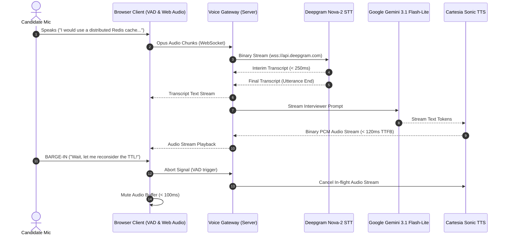

# Phase 7: Real-Time Voice Streaming Gateway

## 📌 Executive Summary

Phase 7 implements the bidirectional, low-latency voice streaming pipeline for full-length mock interviews. It couples **Deepgram Nova-2** for streaming Speech-to-Text (STT) and **Cartesia Sonic** for streaming Text-to-Speech (TTS), with sub-100ms client-side Voice Activity Detection (VAD) barge-in interruption handling.

---

## 🎯 Phase Goals & Deliverables

1. **Streaming Speech-to-Text Bridge (`src/server/voice/stt.ts`)**:
   - Streams browser microphone Opus audio chunks directly to Deepgram Nova-2 (`wss://api.deepgram.com`), returning low-latency interim and final transcripts.
2. **Streaming Text-to-Speech Bridge (`src/server/voice/tts.ts`)**:
   - Streams conversational AI interviewer responses to Cartesia Sonic via WebSocket (`wss://api.cartesia.ai`), transmitting binary audio chunks to the browser Web Audio pipeline.
3. **Turn-Taking & Barge-In Interruption Gateway (`src/server/voice/gateway.ts`)**:
   - Instantly halts Cartesia TTS playback and cancels in-flight LLM generations when the candidate interrupts the AI interviewer.

---

## ⚡ 1. Voice Streaming Architecture & Latency Budget



### End-to-End Latency Budget

- **Deepgram STT (Mic $\rightarrow$ Text)**: $\approx 250\text{ms}$
- **Gemini First Token**: $\approx 300\text{ms}$
- **Cartesia TTS First Byte (Text $\rightarrow$ Audio)**: $\approx 90\text{ms} - 120\text{ms}$
- **Total Conversational Latency**: $\approx 650\text{ms} - 800\text{ms}$ (comparable to natural human pause)
- **Barge-In Interruption Latency**: $\le 100\text{ms}$

---

## 🎙️ 2. Deepgram Streaming STT Bridge (`src/server/voice/stt.ts`)

```typescript
import { createClient } from "@deepgram/sdk";

const deepgramApiKey = process.env.DEEPGRAM_API_KEY!;
const deepgram = createClient(deepgramApiKey);

export function createDeepgramLiveStream(
  onTranscript: (text: string, isFinal: boolean) => void,
) {
  const connection = deepgram.listen.live({
    model: "nova-2",
    language: "en-US",
    smart_format: true,
    interim_results: true,
    utterance_end_ms: 1000,
    vad_events: true,
    endpointing: 300,
  });

  connection.on("Open", () => {
    console.log("Deepgram live connection established.");
  });

  connection.on("Transcript", (data) => {
    const transcript = data.channel.alternatives[0]?.transcript;
    if (transcript) {
      const isFinal = data.is_final || false;
      onTranscript(transcript, isFinal);
    }
  });

  connection.on("Error", (err) => {
    console.error("Deepgram live stream error:", err);
  });

  return {
    sendAudio: (chunk: Buffer | Uint8Array) => {
      if (connection.getReadyState() === 1) {
        connection.send(chunk);
      }
    },
    close: () => {
      connection.finish();
    },
  };
}
```

---

## 🔊 3. Cartesia Streaming TTS Bridge (`src/server/voice/tts.ts`)

```typescript
import Cartesia from "@cartesia/cartesia-js";

const cartesia = new Cartesia({
  apiKey: process.env.CARTESIA_API_KEY!,
});

export async function createCartesiaAudioStream(
  textStream: AsyncIterable<string>,
  onAudioChunk: (chunk: Uint8Array) => void,
  abortSignal: AbortSignal,
) {
  const websocket = cartesia.tts.websocket({
    container: "raw",
    encoding: "pcm_f32le",
    sampleRate: 24000,
  });

  await websocket.connect();

  const voiceId = "a0e99841-438c-4a64-b679-ae501e7d6091"; // Barbershop Man / Tech Interviewer

  const responseStream = await websocket.send({
    model_id: "sonic-english",
    voice: {
      mode: "id",
      id: voiceId,
    },
    transcript: textStream,
  });

  abortSignal.addEventListener("abort", () => {
    websocket.disconnect();
  });

  for await (const message of responseStream) {
    if (abortSignal.aborted) break;
    if (message.audio) {
      onAudioChunk(message.audio);
    }
  }

  websocket.disconnect();
}
```

---

## 🛑 4. Barge-In Interruption Handler (`src/server/voice/gateway.ts`)

When candidate voice energy exceeds the VAD threshold while the interviewer is speaking:

```typescript
export class VoiceSessionGateway {
  private activeAbortController: AbortController | null = null;

  public handleCandidateSpeechStart() {
    if (this.activeAbortController) {
      // Abort ongoing TTS synthesis and playback
      this.activeAbortController.abort();
      this.activeAbortController = null;
      console.log("Barge-in triggered: AI interviewer speech terminated.");
    }
  }

  public prepareInterviewerTurn(): AbortSignal {
    this.activeAbortController = new AbortController();
    return this.activeAbortController.signal;
  }
}
```

---

## ✅ Phase 7 Verification Checklist

- [ ] Deepgram WebSocket connects and transmits interim speech transcripts with sub-300ms latency.
- [ ] Cartesia Sonic generates high-fidelity streaming audio with sub-150ms TTFB.
- [ ] VAD interrupt triggers abort signal and silences audio within 100ms.
- [ ] Mock interview session transcripts record turns accurately into the database.
