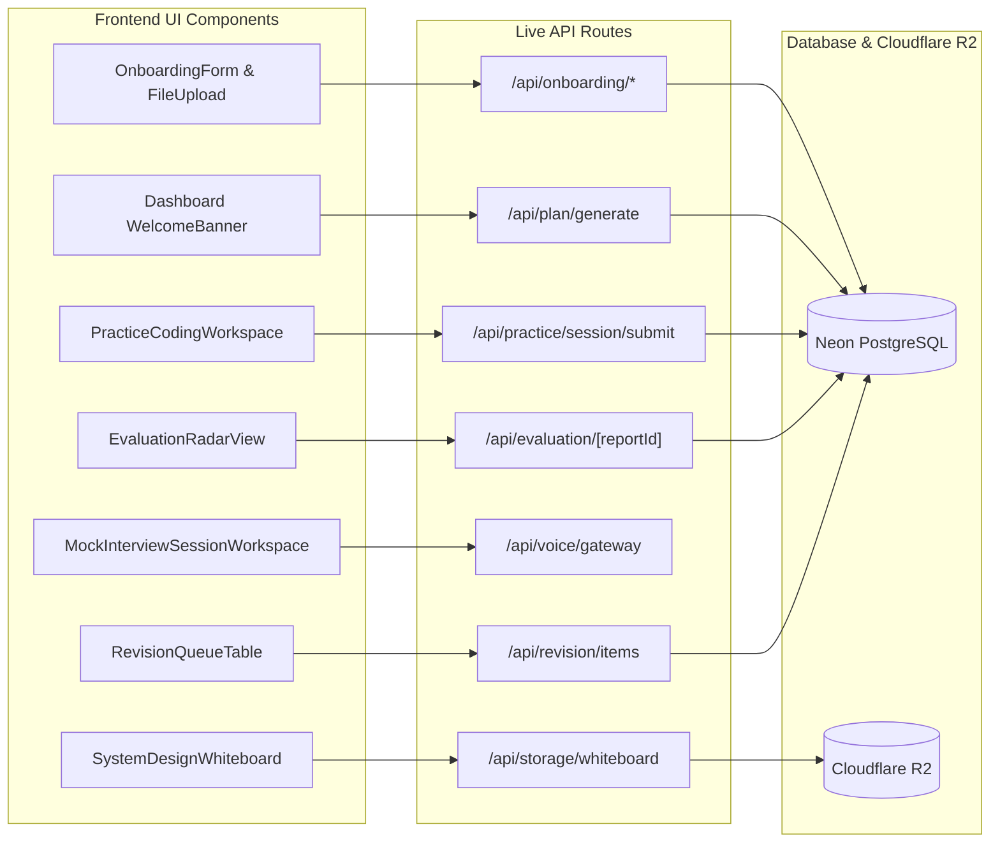

# Phase 8: Frontend-Backend Integration & Production Build

## 📌 Executive Summary

Phase 8 connects the completed frontend UI components across all 43 Next.js routes to the newly created backend APIs and database models. It replaces temporary mock state with live server state, ensures full responsive UI fidelity, and validates the entire build pipeline using Turbopack for production deployment on Cloudflare.

---

## 🎯 Phase Goals & Deliverables

1. **Wire Onboarding & Dashboard**:
   - Connect onboarding steppers and resume uploaders to `/api/onboarding/profile` and `/api/onboarding/resume`.
   - Hydrate dashboard metrics (readiness score, streak count, weekly target progress) directly from Neon.
2. **Wire Practice Coding & System Design**:
   - Connect the code submission and canvas export buttons in `PracticeCodingWorkspace` to `/api/practice/session/submit`.
3. **Wire Mock Interview Live Session**:
   - Connect browser microphone capture and audio playback to the Phase 7 Real-Time Voice Gateway.
4. **Wire Evaluation Hub & Spaced Revision**:
   - Hydrate `/evaluation` radar charts and strengths/improvements breakdown from live `EvaluationReport` records.
   - Hydrate `/revision` queue from live `RevisionItem` data.
5. **Production Build & Turbopack Verification**:
   - Execute `npm run build` to verify 0 type errors, 0 lint failures, and complete route generation across all 43 pages.

---

## 🔌 1. Integration Touchpoints by Module



---

## 🛠️ 2. Dynamic Routing Transition (`next.config.ts`)

During the initial frontend prototype phase, `next.config.ts` was set to `output: "export"`. With the introduction of live API endpoints (`/api/*`), Next.js transitions to hybrid SSR/Edge serverless rendering deployed on Cloudflare via `@opennextjs/cloudflare`.

```typescript
import type { NextConfig } from "next";

const nextConfig: NextConfig = {
  // Dynamic API routes enabled for Cloudflare Pages / Workers
  images: {
    remotePatterns: [
      {
        protocol: "https",
        hostname: "*.r2.cloudflarestorage.com",
      },
    ],
  },
};

export default nextConfig;
```

---

## 🧪 3. Full Production Verification Suite

### Automated Verification Command

```bash
# 1. Typecheck the entire codebase
npx tsc --noEmit

# 2. Run Turbopack production build
npm run build
```

### End-to-End User Flow Verification

1. **Candidate Onboarding**:
   - Sign in via Clerk $\rightarrow$ complete target role form $\rightarrow$ upload sample PDF resume $\rightarrow$ verify personalized plan generated.
2. **Interactive Coding Practice**:
   - Navigate to `/practice/coding` $\rightarrow$ solve "Max Sum Subarray" $\rightarrow$ click "Submit Answer" $\rightarrow$ verify 5-dimension rubric score and readiness delta update on screen.
3. **System Design & Whiteboard**:
   - Open `/practice/system-design` $\rightarrow$ draw architecture on canvas $\rightarrow$ export whiteboard $\rightarrow$ verify image stored in Cloudflare R2 and linked in evaluation.
4. **Mock Interview Simulation**:
   - Launch mock interview $\rightarrow$ speak response into microphone $\rightarrow$ verify real-time interim transcript $\rightarrow$ listen to Cartesia voice playback $\rightarrow$ trigger barge-in and verify instant cutoff.
5. **Evaluation & Revision**:
   - Review `/evaluation` report radar chart $\rightarrow$ verify SM-2 scheduled card appears in `/revision`.

---

## ✅ Phase 8 Verification Checklist

- [ ] All 43 frontend routes continue to render with 0 regressions.
- [ ] Brand theme (`#fbf9f4`, `#ff5520`, `#1e1c1a`) remains 100% consistent across all components.
- [ ] Full build (`npm run build`) completes with 0 errors.
- [ ] Cloudflare deployment manifest (`wrangler.jsonc`) validated for edge production deployment.
