# PrepInMinutes — Master Implementation Roadmap (Phase-Wise)

Welcome to the **PrepInMinutes** Phase-Wise Implementation Roadmap. This directory contains the exhaustive, technical execution blueprints for transitioning PrepInMinutes from a 100% complete static frontend (43 routes) into a live, production-grade, full-stack AI interview preparation platform.

All blueprints are engineered to preserve existing visual and interaction contracts, maintain deterministic core business logic, and utilize our verified infrastructure stack: **Neon Serverless PostgreSQL (with `pgvector`), Upstash Redis, Cloudflare R2, Clerk Authentication, Google Gemini AI (3.1 Flash-Lite & 1536-dim Embeddings), Deepgram Nova-2 STT, and Cartesia Sonic TTS**.

---

## 🗺️ Roadmap Architecture & Flow

```mermaid
flowchart TD
    subgraph P0["Phase 0: Automated Testing Framework"]
        P0_1["0.1 verify-infra.ts (Cloud Health Smoke)"]
        P0_2["0.2 test-phase3-domain.ts (Math Unit Tests)"]
        P0_3["0.3 verify-all.ts (Master Runner Dashboard)"]
    end

    subgraph P1["Phase 1: Persistence Foundation"]
        P1_1["1.1 Prisma ORM & Neon Adapters"]
        P1_2["1.2 Relational & Vector Schema (10 Models)"]
        P1_3["1.3 Database Migration (Neon PostgreSQL)"]
        P1_4["1.4 Catalog Seeding (135+ Topics)"]
    end

    subgraph P2["Phase 2: Infrastructure Singletons"]
        P2_1["2.1 Prisma Client & Tenant Context"]
        P2_2["2.2 Upstash Redis Client"]
        P2_3["2.3 Cloudflare R2 S3 Client"]
        P2_4["2.4 Google Gemini SDK Client"]
    end

    subgraph P3["Phase 3: Deterministic Domain Core"]
        P3_1["3.1 5-Dimension Scoring Engine"]
        P3_2["3.2 Bayesian Readiness Engine"]
        P3_3["3.3 SuperMemo-2 Spaced Repetition"]
    end

    subgraph P4["Phase 4: Edge Security & Middleware"]
        P4_1["4.1 Clerk Route Guard Middleware"]
        P4_2["4.2 Upstash Sliding Rate Limiter"]
        P4_3["4.3 Idempotency Key Interceptor"]
    end

    subgraph P5["Phase 5: Onboarding & Vector APIs"]
        P5_1["5.1 Profile & Target Role API"]
        P5_2["5.2 Resume Parser & pgvector Pipeline"]
        P5_3["5.3 Prep Plan Generation API"]
    end

    subgraph P6["Phase 6: Session & Evaluation APIs"]
        P6_1["6.1 Practice Submission & Evaluation API"]
        P6_2["6.2 Mock Interview End Session API"]
        P6_3["6.3 Evaluation Report Fetch API"]
        P6_4["6.4 Revision Queue Sync API"]
    end

    subgraph P7["Phase 7: Real-Time Voice Gateway"]
        P7_1["7.1 Deepgram Streaming STT Bridge"]
        P7_2["7.2 Cartesia Streaming TTS Bridge"]
        P7_3["7.3 Audio Turn-Taking & Barge-In Handler"]
    end

    subgraph P8["Phase 8: Frontend-Backend Integration"]
        P8_1["8.1 Wire Onboarding & Plan Screens"]
        P8_2["8.2 Wire Practice & Coding Workspaces"]
        P8_3["8.3 Wire Evaluation & Report Hubs"]
        P8_4["8.4 Full System Production Verification"]
    end

    P0 --> P1
    P1 --> P2
    P2 --> P3
    P3 --> P4
    P4 --> P5
    P5 --> P6
    P6 --> P7
    P7 --> P8
```



---

## 📑 Phase Index & Document Catalog

| Phase  | Blueprint Document                                                                           | Core Focus & Deliverables                                                                                                   | Primary Technologies                                                            | Target Files                                                                                                                                                                                 |
| :----: | :------------------------------------------------------------------------------------------- | :-------------------------------------------------------------------------------------------------------------------------- | :------------------------------------------------------------------------------ | :------------------------------------------------------------------------------------------------------------------------------------------------------------------------------------------- |
| **00** | [00-automation-test-framework.md](./00-automation-test-framework.md)                         | Automated cloud smoke tests, scoring/readiness/SM-2 unit tests, test scripts in `package.json`.                             | Node.js, TypeScript, TSX, Test Matrix                                           | `scripts/verify-infra.ts`<br>`scripts/test-phase3-domain.ts`<br>`scripts/verify-all.ts`                                                                                                      |
| **01** | [01-persistence-foundation.md](./01-persistence-foundation.md)                               | Prisma schema, 10 relational models, `pgvector`, database push, and 135+ topic seed catalog.                                | Prisma ORM, Neon PostgreSQL, `pgvector`                                         | `prisma/schema.prisma`<br>`prisma/seed.ts`                                                                                                                                                   |
| **02** | [02-server-infrastructure-clients.md](./02-server-infrastructure-clients.md)                 | Centralized, type-safe serverless client singletons with candidate tenant isolation.                                        | `@prisma/adapter-neon`, `@upstash/redis`, `@aws-sdk/client-s3`, `@google/genai` | `src/server/db/client.ts`<br>`src/server/redis/client.ts`<br>`src/server/storage/r2.ts`<br>`src/server/ai/gemini.ts`                                                                         |
| **03** | [03-deterministic-domain-core.md](./03-deterministic-domain-core.md)                         | Pure mathematical business logic engines: 5-dimension rubric scoring, Bayesian readiness, and SM-2 spaced repetition decay. | Pure TypeScript, KaTeX Math, SM-2 Algorithm                                     | `src/server/domain/scoring.ts`<br>`src/server/domain/readiness.ts`<br>`src/server/domain/spaced-repetition.ts`                                                                               |
| **04** | [04-edge-security-and-middleware.md](./04-edge-security-and-middleware.md)                   | Sub-10ms edge security: Clerk route guard, Upstash sliding window rate limiting, and 24h idempotency interceptor.           | Next.js Edge Middleware, Clerk, Upstash Redis                                   | `src/middleware.ts`<br>`src/server/edge/rate-limiter.ts`<br>`src/server/edge/idempotency.ts`                                                                                                 |
| **05** | [05-onboarding-and-vector-pipeline.md](./05-onboarding-and-vector-pipeline.md)               | Profile setup, resume PDF parsing, 1536-dim vector indexing, and personalized prep roadmap synthesis.                       | Gemini Embedding 001, PDF Parser, Cosine Similarity (`<=>`)                     | `src/app/api/onboarding/profile/route.ts`<br>`src/app/api/onboarding/resume/route.ts`<br>`src/app/api/plan/generate/route.ts`                                                                |
| **06** | [06-session-and-evaluation-apis.md](./06-session-and-evaluation-apis.md)                     | Practice submission evaluation, mock interview grading, report retrieval, and overdue revision synchronization.             | Gemini 3.1 Flash-Lite, Structured JSON Schema, Prisma                           | `src/app/api/practice/session/submit/route.ts`<br>`src/app/api/mock-interview/session/end/route.ts`<br>`src/app/api/evaluation/[reportId]/route.ts`<br>`src/app/api/revision/items/route.ts` |
| **07** | [07-realtime-voice-gateway.md](./07-realtime-voice-gateway.md)                               | Bidirectional streaming voice gateway: Deepgram Nova-2 STT, Cartesia Sonic TTS, and sub-100ms VAD barge-in interruption.    | WebSockets, Deepgram API, Cartesia API, Web Audio API                           | `src/server/voice/stt.ts`<br>`src/server/voice/tts.ts`<br>`src/server/voice/gateway.ts`                                                                                                      |
| **08** | [08-frontend-integration-and-verification.md](./08-frontend-integration-and-verification.md) | Wire frontend state to live backend endpoints across all modules without breaking 43 routes; full Turbopack build.          | React 19, Next.js 16, Turbopack, Tailwind CSS                                   | `src/app/*`<br>`src/components/*`<br>`src/types/*`                                                                                                                                           |

---

## 🏛️ Core Architectural Invariants

Every phase in this roadmap strictly abides by these four non-negotiable rules:

1. **Deterministic Core Invariant**:
   - The LLM (Google Gemini) generates qualitative observations, code diff suggestions, and structured extractions.
   - Mathematical calculations (0–100 readiness scores, 5-dimension rubric weighting, SM-2 decay timestamps) are strictly calculated by deterministic TypeScript functions in `src/server/domain/`.
2. **Tenant Isolation Invariant**:
   - Every database query and storage lookup must be scoped to the authenticated candidate via `withCandidateContext(clerkUserId)`. Cross-tenant data leaks are impossible at the database client level.
3. **Zero UI Regressions Invariant**:
   - All 43 Next.js routes, visual styling (`#fbf9f4`, `#ff5520`, `#1e1c1a`), typography, and interactive canvas components must remain 100% operational during and after each phase.
4. **Edge Latency & Cost Protection Invariant**:
   - Upstash sliding-window rate limiters protect LLM endpoints (10 requests/minute per candidate) and S3 storage endpoints from runaway costs.
   - Idempotency keys (`{sessionId}:{attempt}`) prevent duplicate LLM calls if a candidate double-clicks or retries submissions.

---

## ⚙️ Environment Variables Cross-Reference

Each phase relies on keys already provisioned and verified in file `.env`:

```bash
# Phase 1 & 2: Database & Caching (Configured in .env & Cloudflare)
DATABASE_URL="postgresql://[user]:[password]@[endpoint]-pooler.aws.neon.tech/[database]?sslmode=require"
DIRECT_URL="postgresql://[user]:[password]@[endpoint].aws.neon.tech/[database]?sslmode=require"
UPSTASH_REDIS_REST_URL="https://[database].upstash.io"
UPSTASH_REDIS_REST_TOKEN="[upstash_token]"

# Phase 2 & 5: Cloudflare R2 Storage
R2_ACCOUNT_ID="[cloudflare_account_id]"
R2_ACCESS_KEY_ID="[r2_access_key_id]"
R2_SECRET_ACCESS_KEY="[r2_secret_access_key]"
R2_BUCKET_NAME="prepinminutes-assets"
R2_ENDPOINT="https://[account_id].r2.cloudflarestorage.com"

# Phase 2, 5 & 6: Google Gemini AI
GEMINI_API_KEY="[gemini_api_key]"
GEMINI_PROJECT_ID="projects/[project_number]"

# Phase 7: Real-Time Voice
DEEPGRAM_PROJECT_ID="[deepgram_project_id]"
DEEPGRAM_API_KEY="[deepgram_api_key]"
CARTESIA_API_KEY="sk_car_xxxxxxxxxxxxxxxxxxxx"

# Phase 4 & 8: Authentication
NEXT_PUBLIC_CLERK_PUBLISHABLE_KEY="pk_test_xxxxxxxxxxxxxxxxxxxxxxxxxxxxxxxxxxxx"
CLERK_SECRET_KEY="sk_test_xxxxxxxxxxxxxxxxxxxxxxxxxxxxxxxxxxxxxxxxxxxxxxxx"
```
