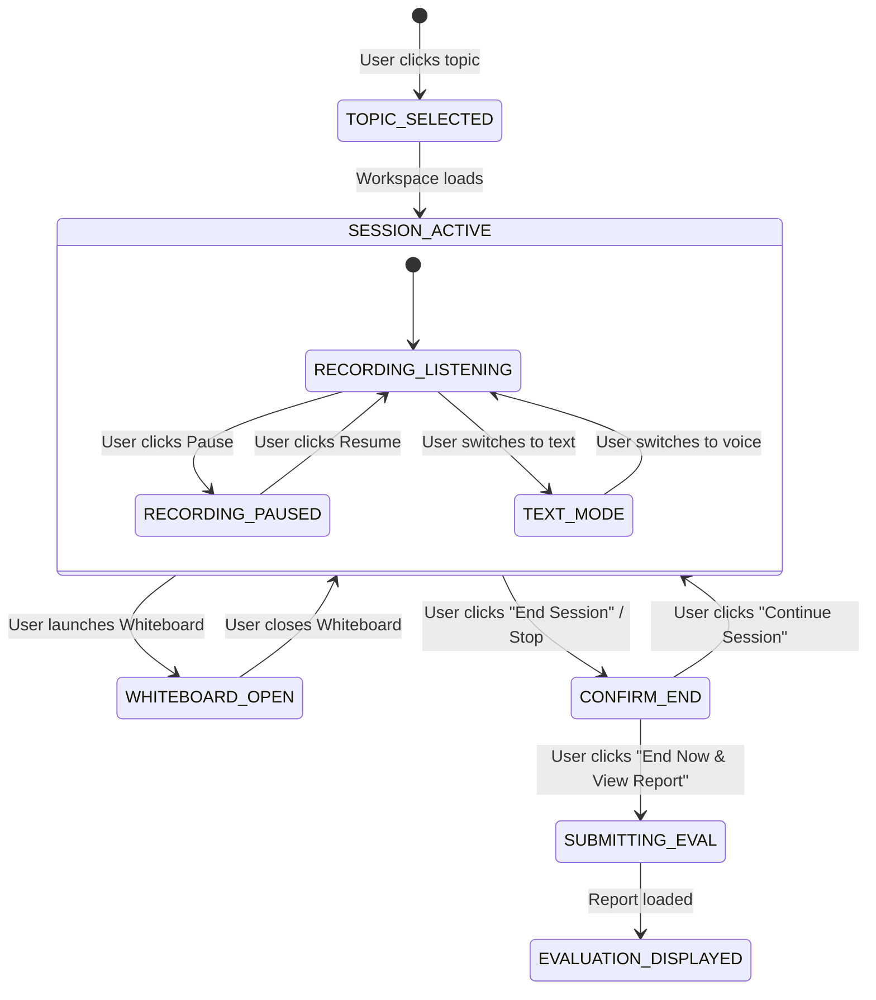

# Practice Module — Session State Machine & Timers

This document specifies the lifecycle states, timer ticks, and submission flow for interactive practice drills.

---

## 1. Practice Session State Machine

---

## 2. Timer Management & Session Resume

- **Elapsed Timer**: Runs every 1000ms using `setInterval` while `!isPaused`.
- **Display**: Formatted via `formatTimer(secondsElapsed) / 45:00` with pulsing red dot when active.
- **Persistence**: Periodically stores `practice_session_seconds` to sessionStorage so that an accidental browser refresh does not reset elapsed interview time.
