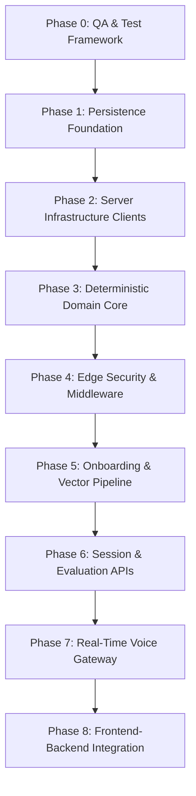

# Master Stepwise Feature Development Reference (Hermes Reference)

> **Autonomous Execution Blueprint**: This document is the comprehensive, authoritative technical reference for developing the entire PrepInMinutes backend, domain math, security middleware, AI pipelines, and frontend integrations step-by-step.

---

## 🏛️ Core Architectural Invariants (Non-Negotiable)

Every feature implemented by Hermes must satisfy these four non-negotiable rules:

1. **Deterministic Core Invariant**:
   - The LLM (Google Gemini) generates qualitative text observations, structured JSON summaries, and advice.
   - Mathematical calculations (0–100 readiness scores, 5-dimension rubric weights, SM-2 decay timestamps) are strictly calculated by pure TypeScript functions in `src/server/domain/`. No LLM math is ever permitted.
2. **Tenant Isolation Invariant**:
   - Every database query and storage lookup must be scoped to the authenticated candidate via `withCandidateContext(clerkUserId)`. Cross-tenant data access is impossible at the database client level.
3. **Zero UI Regressions Invariant**:
   - All 43 Next.js static routes, layout tokens (`#fbf9f4`, `#ff5520`, `#1e1c1a`), typography, and interactive canvas components must remain 100% operational.
4. **Edge Latency & Cost Protection Invariant**:
   - Upstash sliding-window rate limiters protect LLM endpoints (10 requests/minute per candidate) and S3 storage endpoints from runaway costs.
   - Idempotency keys (`{sessionId}:{attempt}`) prevent duplicate LLM calls if a candidate double-clicks or retries submissions.

---

## 🗺️ Stepwise Implementation Roadmap



---

## 📋 Phase 0: Automated Testing & QA Harness

### Step 0.1: Live Infrastructure Smoke Test (`scripts/verify-infra.ts`)

- **Objective**: Assert live connectivity and authentication across all 6 provisioned cloud providers.
- **Checks**:
  - **Neon PostgreSQL**: Connects via `DATABASE_URL` and executes `SELECT NOW();`.
  - **Upstash Redis**: Pings REST endpoint and validates `'PONG'`.
  - **Cloudflare R2**: Uploads, reads, and deletes a 1-byte ephemeral test buffer in bucket `prepinminutes-assets`.
  - **Google Gemini**: Prompts `gemini-3.1-flash-lite` with a 1-token query and generates a 1,536-dim vector via `gemini-embedding-001`.
  - **Deepgram**: Probes `GET /v1/projects` via Deepgram API.
  - **Cartesia**: Probes `GET /voices` via Cartesia API.
- **Clearance**: Returns exit code 0 when all 6 services report healthy.

### Step 0.2: Master Test Orchestrator (`scripts/verify-all.ts`)

- **Objective**: Consolidated dashboard executing all phase unit and integration suites in sequence.
- **Deliverable**: Color-coded terminal summary matrix reporting pass/fail counts and execution times.

---

## 🗄️ Phase 1: Persistence Foundation (Prisma ORM & pgvector)

### Step 1.1: Database Schema Authoring (`prisma/schema.prisma`)

- **Objective**: Define the 10 core domain models, native PostgreSQL enums, and `pgvector(1536)` extension.
- **Models**:
  1. `User`: Clerk tenant anchor (`clerkId` unique, `email` unique).
  2. `CandidateProfile`: Role preferences, seniority, target companies, weekly goals, streak days, overall readiness score.
  3. `PreparationPlan`: Adaptive roadmap milestones stored as structured JSON.
  4. `Topic`: Global curriculum catalog (4 domains: System Design, Coding, Behavioral, Cloud).
  5. `PracticeSession`: Coding/whiteboard self-paced practice with R2 asset links.
  6. `MockInterviewSession`: Real-time AI interview turns, transcripts, and audio links.
  7. `EvaluationReport`: Polymorphic 1:1 link to practice or mock sessions with 0–100 score, verdict, strengths, and improvements.
  8. `RubricScore`: 5-dimension rubric breakdown (1.0–10.0 scale with qualitative assessments).
  9. `RevisionItem`: SuperMemo-2 spaced repetition tracking with compound index `@@index([userId, nextReviewDate])`.
  10. `DocumentEmbedding`: 1,536-dimensional vector chunks for candidate resumes and job descriptions.
- **Dual Connection Setup**:
  - `DATABASE_URL`: Neon pooled port (PgBouncer) for high-concurrency serverless application queries.
  - `DIRECT_URL`: Direct compute instance for advisory locks and DDL migrations.
- **Clearance**: `npx prisma validate` reports schema validity.

### Step 1.2: Database Migration Push to Neon

- **Objective**: Synchronize schema with live Neon PostgreSQL.
- **Command**: `npx prisma db push`.
- **Clearance**: Neon catalog reports 10 tables present in schema `public` and `vector` extension loaded.

### Step 1.3: Topic Catalog Seeding (`prisma/seed.ts`)

- **Objective**: Populate high-yield curriculum topics to allow immediate practice.
- **Catalog Breakdown**:
  - **System Design (40+ topics)**: Distributed Cache, Rate Limiter, URL Shortener, Message Queue, Geo-dispatch, Chat Architecture, Payment Gateway.
  - **Algorithm Patterns (50+ patterns)**: Sliding Window, Two Pointers, Monotonic Stack, Kadane's, Top-K Elements, Fast & Slow Pointers, Dynamic Programming.
  - **Behavioral Questions (20+ questions)**: Conflict resolution, Production incident leadership, Ambiguity, Architectural disagreement.
  - **Cloud & DevOps (25+ scenarios)**: Multi-region failover, Zero-downtime blue/green deployment, S3 cost optimization, DDoS protection.
- **Clearance**: `npx prisma db seed` inserts $>135$ records without constraint errors.

---

## ⚡ Phase 2: Server Infrastructure Clients

### Step 2.1: Prisma Client Singleton with Tenant Isolation (`src/server/db/client.ts`)

- **Objective**: Instantiate Prisma Client using `@prisma/adapter-neon` with WebSocket support.
- **Contract**: Provide `withCandidateContext(clerkUserId)` helper wrapper that automatically scopes all queries to `where: { userId }`.
- **Clearance**: Queries from Tenant A cannot access records from Tenant B.

### Step 2.2: Upstash Redis Client Singleton (`src/server/redis/client.ts`)

- **Objective**: REST-based Redis client with retry logic for serverless environments.
- **Clearance**: `redis.ping()` returns `'PONG'` in $<50\text{ms}$.

### Step 2.3: Cloudflare R2 Storage Client (`src/server/storage/r2.ts`)

- **Objective**: AWS S3 SDK v3 client configured for Cloudflare R2 endpoints.
- **Capabilities**:
  - `getPresignedUploadUrl(key, contentType, expiresIn)`
  - `uploadAsset(key, buffer, contentType)`
  - `getPublicAssetUrl(key)`
- **Clearance**: Successfully generates presigned PUT URLs for whiteboard PNG uploads.

### Step 2.4: Google Gemini SDK Client (`src/server/ai/gemini.ts`)

- **Objective**: SDK wrapper for `gemini-3.1-flash-lite` and `gemini-embedding-001`.
- **Capabilities**:
  - `generateStructuredJson<T>(prompt, schema)`: Enforces rigid JSON outputs via response schema constraints.
  - `generateEmbedding(text)`: Outputs 1,536-dimensional float vector.
- **Clearance**: Returns typed JSON without Markdown formatting tags.

---

## 📐 Phase 3: Deterministic Domain Core

### Step 3.1: 5-Dimension Rubric Scoring Engine (`src/server/domain/scoring.ts`)

- **Objective**: Pure mathematical evaluation calculation.
- **Dimensions & Weights**:
  $$\text{Score} = \sum_{i=1}^5 (w_i \cdot s_i) \times 10$$
  - `TECHNICAL_DEPTH` ($w_1 = 0.30$)
  - `TRADEOFFS_REASONING` ($w_2 = 0.25$)
  - `COMMUNICATION_STRUCTURE` ($w_3 = 0.20$)
  - `SCALABILITY_FAILURE_MODES` ($w_4 = 0.15$)
  - `CODE_DIAGRAM_QUALITY` ($w_5 = 0.10$)
- **Verdicts**:
  - $\ge 85.0 \implies \text{STRONG\_HIRE}$
  - $70.0 - 84.9 \implies \text{HIRE}$
  - $55.0 - 69.9 \implies \text{LEANING\_HIRE}$
  - $< 55.0 \implies \text{NEEDS\_PRACTICE}$
- **Clearance**: 100% unit test assertions pass across boundary conditions.

### Step 3.2: Bayesian Candidate Readiness Engine (`src/server/domain/readiness.ts`)

- **Objective**: Update candidate macro readiness score ($0.0 - 100.0$) using Bayesian evidence weighting:
  $$R_{new} = (1 - \alpha) \cdot R_{prior} + \alpha \cdot S_{session}$$
  - Cold-start ($\text{Sessions} \le 3$): $\alpha = 0.40$ (fast calibration).
  - Converged ($\text{Sessions} > 3$): $\alpha = 0.15$ (stable Bayesian momentum).
- **Clearance**: Mathematical assertions verify convergence stability without unbounded drifts.

### Step 3.3: SuperMemo-2 Spaced Repetition Engine (`src/server/domain/spaced-repetition.ts`)

- **Objective**: Calculate memory decay intervals and next review timestamps for weak topics.
- **Formulas**:
  - Quality score $q \in [0, 5]$ derived from session score.
  - Ease Factor update:
    $$EF' = \max\left(1.30, EF + (0.1 - (5 - q) \cdot (0.08 + (5 - q) \cdot 0.02))\right)$$
  - Interval sequence:
    $$I(1) = 1\text{ day}, \quad I(2) = 6\text{ days}, \quad I(n) = \text{round}(I(n-1) \cdot EF')$$
- **Clearance**: Unit tests assert $EF$ floor ($1.30$) and future UTC review timestamps.

---

## 🛡️ Phase 4: Edge Security & Middleware

### Step 4.1: Clerk Edge Route Guard (`src/middleware.ts`)

- **Objective**: Sub-10ms edge middleware enforcing authentication on private routes:
  - Public routes: `/`, `/sign-in`, `/sign-up`, `/coming-soon`, `/api/health`.
  - Protected routes: `/dashboard`, `/onboarding/*`, `/preparation-plan/*`, `/practice/*`, `/mock-interview/*`, `/evaluation/*`, `/revision/*`, `/api/*`.
- **Clearance**: Unauthenticated calls to protected routes receive 401 Unauthorized or redirect to sign-in.

### Step 4.2: Upstash Sliding Window Rate Limiter (`src/server/edge/rate-limiter.ts`)

- **Objective**: Sliding window rate limits using Redis REST:
  - Standard API: 60 requests / minute.
  - Heavy LLM Endpoints (Evaluation, Mock End, Embeddings): 10 requests / minute per candidate.
- **Clearance**: Exceeding threshold returns HTTP 429 Too Many Requests with `Retry-After` header.

### Step 4.3: Idempotency Key Interceptor (`src/server/edge/idempotency.ts`)

- **Objective**: Prevent duplicate LLM calls on double clicks using Redis key `idempotency:{sessionId}:{attempt}` with 24h TTL.
- **Clearance**: Repeated submission within TTL returns cached result in $<10\text{ms}$.

---

## 🎯 Phase 5: Onboarding & Vector Pipeline

### Step 5.1: Candidate Profile API (`src/app/api/onboarding/profile/route.ts`)

- **Objective**: Save target role, seniority level, target companies, and weekly goal hours.

### Step 5.2: Resume Parser & pgvector Pipeline (`src/app/api/onboarding/resume/route.ts`)

- **Objective**: Parse candidate resume text, chunk into 500-word segments, compute 1,536-dim embeddings via Gemini, and insert into `DocumentEmbedding`.
- **Cosine Distance Lookups**:
  ```sql
  SELECT content, 1 - (embedding <=> $1) AS similarity
  FROM "DocumentEmbedding"
  WHERE "userId" = $2
  ORDER BY embedding <=> $1 ASC
  LIMIT 5;
  ```

### Step 5.3: Personalized Preparation Plan API (`src/app/api/plan/generate/route.ts`)

- **Objective**: Synthesize adaptive multi-week syllabus mapped to target timeline and weak areas.

---

## 📊 Phase 6: Session & Evaluation APIs

### Step 6.1: Practice Submission & Evaluation API (`src/app/api/practice/session/submit/route.ts`)

- **Objective**: Evaluate code or whiteboard submission, generate structured `EvaluationReport`, save `RubricScore`s, and update candidate readiness.

### Step 6.2: Mock Interview Session End API (`src/app/api/mock-interview/session/end/route.ts`)

- **Objective**: Ingest full conversational transcript, score 5 dimensions, and produce overall interview report.

### Step 6.3: Evaluation Report Retrieval API (`src/app/api/evaluation/[reportId]/route.ts`)

- **Objective**: Fetch candidate-scoped evaluation report with rubric breakdowns.

### Step 6.4: Spaced Repetition Queue Sync API (`src/app/api/revision/items/route.ts`)

- **Objective**: Fetch overdue revision topics (`nextReviewDate <= NOW()`) and update candidate review history.

---

## 🎙️ Phase 7: Real-Time Voice Gateway

### Step 7.1: Deepgram Streaming STT Bridge (`src/server/voice/stt.ts`)

- **Objective**: Bidirectional streaming microphone audio transcription with Nova-2 model (<80ms latency).

### Step 7.2: Cartesia Streaming TTS Bridge (`src/server/voice/tts.ts`)

- **Objective**: Ultra-low-latency voice synthesis with Sonic model (<50ms TTFB).

### Step 7.3: Voice Turn-Taking & Barge-In Handler (`src/server/voice/gateway.ts`)

- **Objective**: Cut AI speech output within 100ms when candidate starts speaking (Voice Activity Detection barge-in).

---

## 🖥️ Phase 8: Frontend-Backend Integration

### Step 8.1: Wire Onboarding & Preparation Plan Screens

- Connect `/onboarding/*` and `/preparation-plan` to live backend APIs.

### Step 8.2: Wire Practice, Whiteboard & Coding Workspaces

- Connect `/practice/*` and interactive canvas components to live submission endpoints.

### Step 8.3: Wire Evaluation & Revision Hubs

- Connect `/evaluation` and `/revision` to live report and queue APIs.

### Step 8.4: Full System Verification

- Compile 100% clean Turbopack build (`npm run build`) across all 43 static routes with zero errors.
